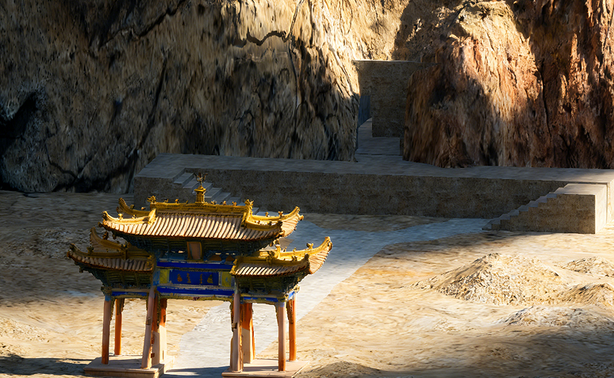
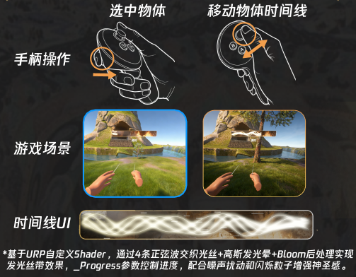
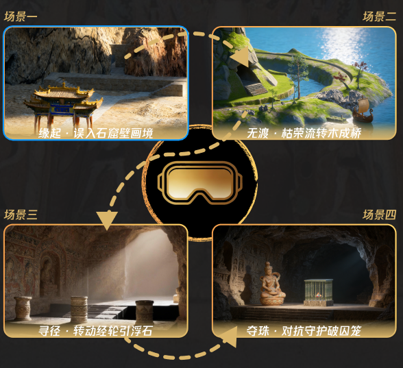

# 壁上观·溯时 - 沉浸式石窟文化遗产重构 VR

## 项目背景
> **"色彩尚在，意义却已残缺。而你来到这里，是为了让它重新完整。"**

本项目是对佛教石窟（如克孜尔、敦煌）艺术中**“异时同图”**叙事手法的数字化重构。
针对实体文物消隐与大众认知断层的困境，本项目并未单纯进行视觉复刻，而是将壁画背后的动态故事游戏化。玩家扮演壁画修复师/善事太子，在虚拟空间中通过操控“时间线”，体验古人眼中的时空流转。

## 核心机制：时间轴交互 (Temporal Interaction)
本项目开发了一套基于手柄射线的**时间操控系统**：

* **时间选中**：使用 VR 手柄射线指向特定物体（如植物、建筑废墟），物体产生高亮反馈。

* **线性流转**：按下扳机键激活“时间UI”，通过摇杆左右推拉，实时改变物体的时间属性。
    * **形态演变**：控制幼苗瞬间长成参天大树（用于搭建桥梁）。
    * **状态修复**：将破损的斧头回溯至崭新锋利的状态。
    * **空间位移**：利用浮石板在不同时间维度的位置变化构建通路。

## 剧情

本游戏剧情改编自敦煌石窟第296窟《善事太子本生》

故事发生在一个古老的异域王国。玩家扮演的善事太子天性善良，拥有操控时间线的能力。当国家遭遇灾害、国库空虚时，他与心怀嫉妒的兄弟——恶事太子一同前往海外龙宫求取能实现一切愿望的摩尼宝珠。旅途中，善事太子用智慧和善良解决了重重困难，但最终却被恶事太子背叛，双目失明，宝珠也被夺走。在失明期间，善事太子获得了心灵的成长和神明的帮助，重获光明后返回王国，与利用宝珠力量扭曲整个世界的恶事太子展开了一场关于“时间”的终极对决。

## 关卡设计
游戏包含完整的叙事流程，旨在传达“善恶”与“时间”的哲学思考：

| 关卡     | 场景           | 核心玩法/谜题                                                |
| :------- | :------------- | :----------------------------------------------------------- |
| **序章** | 偶入石窟壁画境 | 触摸泛黄壁画，触发转场，从“修复师”化身为“善事太子”。         |
| **无渡** | 枯荣流转木成桥 | **谜题：** 利用时间之力催生河岸幼苗，修复破损斧头伐木，构建渡河通路。 |
| **寻径** | 转动经轮引浮石 | **谜题：** 操控三个转经轮控制悬浮石板的时间线，使其停留在正确的位置以连接断路。 |
| **终章** | 对抗守护破囚笼 | **BOSS战：** 对抗宝珠守护者，解开笼罩在摩尼宝珠上的三个“时间之结”。 |

##  开发环境与技术栈 

本项目基于 **Unity 6.3 (6000.3.2f1)** 开发，专为 PICO VR 设备优化。为确保项目能正确运行，请参考以下配置：

* **引擎**: Unity 6 (Version: `6000.0.3.2f1`)
* **平台**: Android (Target Device: PICO 4 / PICO 4 Ultra)
* **VR SDK**: PICO Unity OpenXR SDK
* **VR Interaction**: XR Interaction Toolkit (XRI)
* **渲染管线**: URP (Universal Render Pipeline)
* **关键依赖 (Packages)**:
    * `com.unity.xr.interaction.toolkit`
    * `com.unity.xr.openxr`
    * `com.unity.render-pipelines.universal`

## 演示视频
> [点击观看 Bilibili 完整演示视频]([壁上观·溯时——沉浸式石窟文化遗产重构VR Demo_哔哩哔哩_bilibili](https://www.bilibili.com/video/BV1Q66tBcEAf/?spm_id_from=333.1387.homepage.video_card.click&vd_source=bf08880c4c4d8fdcca4d17ed2ee821fe))

## 安装与运行
1. Clone 本仓库。
2. 使用 Unity 6.3 及以上版本打开项目。
3. 确保已安装[PICO Unity OpenXR SDK](https://developer-cn.picoxr.com/document/unity-openxr)和XR Interaction Toolkit。
4. 使用USB数据线连接 PICO VR 头显(作者使用的是PICO4 Ultra) 和电脑，并在头显中打开USB调试
5. 在Unity中点击Build And Run

---
*Created by Jiale Ma and Qi Zhang*